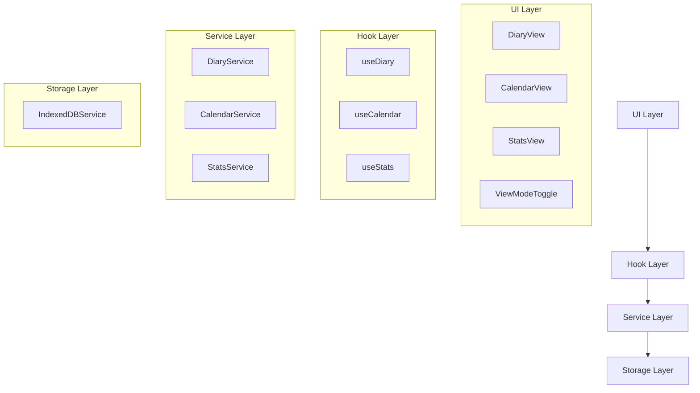
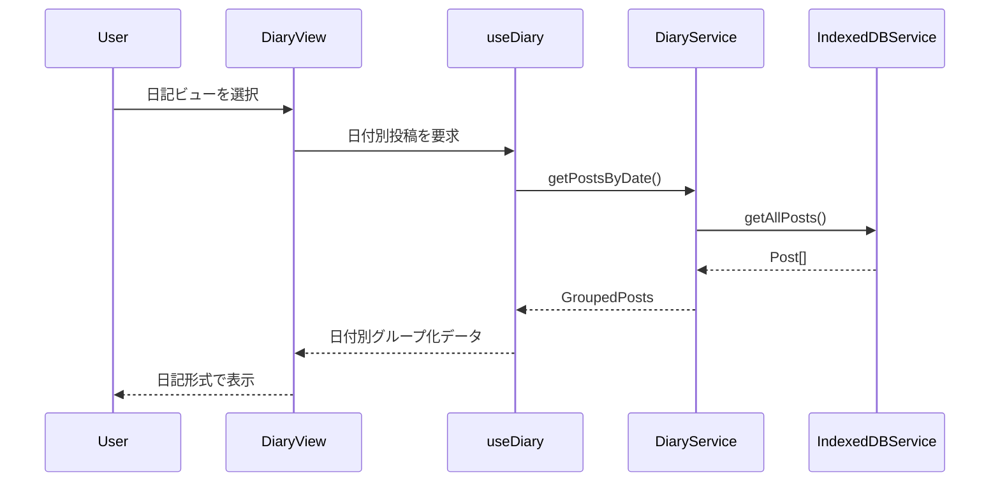

# 設計書

## 概要

Timeline Memo アプリに日記管理機能を追加し、既存のタイムライン表示に加えて日付ベースの整理された表示を提供します。この機能により、ユーザーは日記のように投稿を管理し、投稿履歴を効率的に確認できるようになります。

## アーキテクチャ

### 全体構成



### データフロー



## コンポーネントとインターフェース

### 新規型定義

```typescript
// 日記関連の型定義
export interface DiaryEntry {
  date: string; // YYYY-MM-DD形式
  posts: Post[];
  postCount: number;
}

export interface CalendarDay {
  date: Date;
  hasPost: boolean;
  postCount: number;
  isToday: boolean;
  isSelected: boolean;
}

export interface DiaryStats {
  totalPosts: number;
  totalDays: number;
  currentStreak: number;
  longestStreak: number;
  thisMonthPosts: number;
  averagePostsPerDay: number;
}

export interface DateRange {
  start: Date;
  end: Date;
}

// ビューモードの拡張
export type ViewMode = 'timeline' | 'list' | 'diary' | 'calendar';

// 日記サービスインターフェース
export interface DiaryService {
  getEntriesByDateRange(start: Date, end: Date): Promise<DiaryEntry[]>;
  getEntryByDate(date: Date): Promise<DiaryEntry | null>;
  getCalendarData(year: number, month: number): Promise<CalendarDay[]>;
  getStats(): Promise<DiaryStats>;
  calculateStreak(posts: Post[]): { current: number; longest: number };
}
```

### 新規コンポーネント

#### 1. DiaryView コンポーネント
```typescript
interface DiaryViewProps {
  entries: DiaryEntry[];
  selectedDate?: Date;
  onDateSelect: (date: Date) => void;
  onPostSelect: (postId: string) => void;
}
```

**責務:**
- 日付ごとにグループ化された投稿の表示
- 日付ヘッダーと投稿リストの管理
- 空の日付の非表示処理

#### 2. CalendarView コンポーネント
```typescript
interface CalendarViewProps {
  year: number;
  month: number;
  calendarData: CalendarDay[];
  selectedDate?: Date;
  onDateClick: (date: Date) => void;
  onMonthChange: (year: number, month: number) => void;
}
```

**責務:**
- カレンダー形式での投稿履歴表示
- 投稿がある日のハイライト表示
- 月の切り替え機能

#### 3. DiaryStatsPanel コンポーネント
```typescript
interface DiaryStatsPanelProps {
  stats: DiaryStats;
  isLoading: boolean;
}
```

**責務:**
- 投稿統計の表示
- 継続日数の可視化
- 月間サマリーの表示

#### 4. ViewModeSelector コンポーネント
```typescript
interface ViewModeSelectorProps {
  currentMode: ViewMode;
  onModeChange: (mode: ViewMode) => void;
}
```

**責務:**
- ビューモードの切り替えUI
- 現在のモード表示

### 既存コンポーネントの拡張

#### AppState の拡張
```typescript
export interface AppState {
  // 既存フィールド
  posts: Post[];
  selectedPostId: string | null;
  highlightedPostIds: string[];
  loading: LoadingState;
  error: string | null;
  toasts: Toast[];
  
  // 新規フィールド
  viewMode: ViewMode; // 'list' から ViewMode に変更
  selectedDate: Date | null;
  diaryEntries: DiaryEntry[];
  calendarData: CalendarDay[];
  diaryStats: DiaryStats | null;
}
```

#### AppAction の拡張
```typescript
export type AppAction = 
  // 既存アクション
  | { type: 'LOAD_POSTS'; payload: Post[] }
  | { type: 'ADD_POST'; payload: Post }
  | { type: 'UPDATE_POST'; payload: Post }
  | { type: 'DELETE_POST'; payload: string }
  | { type: 'SELECT_POST'; payload: string | null }
  | { type: 'HIGHLIGHT_POST'; payload: string }
  | { type: 'HIGHLIGHT_POSTS'; payload: string[] }
  | { type: 'CLEAR_HIGHLIGHT' }
  | { type: 'SET_LOADING'; payload: LoadingState }
  | { type: 'SET_ERROR'; payload: string | null }
  | { type: 'CLEAR_ERROR' }
  | { type: 'ADD_TOAST'; payload: Toast }
  | { type: 'REMOVE_TOAST'; payload: string }
  | { type: 'CLEAR_TOASTS' }
  
  // 新規アクション
  | { type: 'SET_VIEW_MODE'; payload: ViewMode }
  | { type: 'SET_SELECTED_DATE'; payload: Date | null }
  | { type: 'LOAD_DIARY_ENTRIES'; payload: DiaryEntry[] }
  | { type: 'LOAD_CALENDAR_DATA'; payload: CalendarDay[] }
  | { type: 'LOAD_DIARY_STATS'; payload: DiaryStats };
```

## データモデル

### 日記エントリーのグループ化ロジック

```typescript
// 投稿を日付でグループ化する関数
function groupPostsByDate(posts: Post[]): DiaryEntry[] {
  const grouped = new Map<string, Post[]>();
  
  posts.forEach(post => {
    const dateKey = post.createdAt.toISOString().split('T')[0];
    if (!grouped.has(dateKey)) {
      grouped.set(dateKey, []);
    }
    grouped.get(dateKey)!.push(post);
  });
  
  return Array.from(grouped.entries())
    .map(([date, posts]) => ({
      date,
      posts: posts.sort((a, b) => b.createdAt.getTime() - a.createdAt.getTime()),
      postCount: posts.length
    }))
    .sort((a, b) => b.date.localeCompare(a.date));
}
```

### カレンダーデータの生成

```typescript
// 指定月のカレンダーデータを生成
function generateCalendarData(year: number, month: number, posts: Post[]): CalendarDay[] {
  const daysInMonth = new Date(year, month, 0).getDate();
  const today = new Date();
  const postsByDate = groupPostsByDate(posts);
  
  const calendarDays: CalendarDay[] = [];
  
  for (let day = 1; day <= daysInMonth; day++) {
    const date = new Date(year, month - 1, day);
    const dateKey = date.toISOString().split('T')[0];
    const dayEntry = postsByDate.find(entry => entry.date === dateKey);
    
    calendarDays.push({
      date,
      hasPost: !!dayEntry,
      postCount: dayEntry?.postCount || 0,
      isToday: isSameDay(date, today),
      isSelected: false
    });
  }
  
  return calendarDays;
}
```

### 統計計算ロジック

```typescript
// 投稿統計を計算
function calculateDiaryStats(posts: Post[]): DiaryStats {
  const entries = groupPostsByDate(posts);
  const today = new Date();
  const thisMonth = new Date(today.getFullYear(), today.getMonth(), 1);
  const nextMonth = new Date(today.getFullYear(), today.getMonth() + 1, 1);
  
  // 今月の投稿数
  const thisMonthPosts = posts.filter(post => 
    post.createdAt >= thisMonth && post.createdAt < nextMonth
  ).length;
  
  // 継続日数の計算
  const { current, longest } = calculateStreak(entries);
  
  return {
    totalPosts: posts.length,
    totalDays: entries.length,
    currentStreak: current,
    longestStreak: longest,
    thisMonthPosts,
    averagePostsPerDay: entries.length > 0 ? posts.length / entries.length : 0
  };
}
```

## エラーハンドリング

### 日記機能固有のエラー

```typescript
export type DiaryError = 
  | { type: 'DATE_RANGE_ERROR'; message: string }
  | { type: 'CALENDAR_GENERATION_ERROR'; message: string }
  | { type: 'STATS_CALCULATION_ERROR'; message: string };
```

### エラー処理戦略

1. **日付範囲エラー**: 無効な日付範囲が指定された場合のフォールバック
2. **カレンダー生成エラー**: 月データ生成失敗時のデフォルト表示
3. **統計計算エラー**: 統計データ取得失敗時の部分表示

## テスト戦略

### 単体テスト

1. **DiaryService のテスト**
   - 日付グループ化ロジック
   - カレンダーデータ生成
   - 統計計算の正確性

2. **Hook のテスト**
   - useDiary の状態管理
   - useCalendar の月切り替え
   - useStats の統計更新

3. **コンポーネントのテスト**
   - DiaryView の表示ロジック
   - CalendarView のインタラクション
   - ViewModeSelector の切り替え

### 統合テスト

1. **ビュー切り替えフロー**
   - タイムライン → 日記ビューの切り替え
   - 日記ビュー → カレンダービューの切り替え
   - データの整合性確認

2. **日付選択フロー**
   - カレンダーから日付選択
   - 該当日の投稿表示
   - 投稿詳細への遷移

3. **統計更新フロー**
   - 新規投稿作成時の統計更新
   - 投稿削除時の統計更新
   - 継続日数の正確な計算

### E2Eテスト

1. **日記機能の完全フロー**
   - 複数日にわたる投稿作成
   - 日記ビューでの確認
   - カレンダービューでの履歴確認
   - 統計情報の確認

2. **レスポンシブ対応**
   - モバイルでのカレンダー表示
   - タブレットでの日記ビュー
   - デスクトップでの統計パネル

## パフォーマンス考慮事項

### 最適化戦略

1. **データの仮想化**
   - 大量の日記エントリーに対する仮想スクロール
   - カレンダーの月単位での遅延読み込み

2. **キャッシュ戦略**
   - 月別カレンダーデータのキャッシュ
   - 統計情報の定期更新とキャッシュ

3. **計算の最適化**
   - 継続日数計算のメモ化
   - 日付グループ化の効率化

### メモリ管理

1. **大量データ対応**
   - 表示範囲外のデータの解放
   - 不要なコンポーネントのアンマウント

2. **状態管理の最適化**
   - 必要最小限の状態保持
   - 計算結果のキャッシュ

## セキュリティ考慮事項

### データ保護

1. **日付データの検証**
   - 不正な日付範囲の拒否
   - XSS攻撃の防止

2. **統計情報の保護**
   - 個人情報の匿名化
   - 統計データの暗号化（将来的）

## 実装フェーズ

### フェーズ1: 基本機能
- DiaryView コンポーネント
- 日付グループ化ロジック
- ビューモード切り替え

### フェーズ2: カレンダー機能
- CalendarView コンポーネント
- 月別データ生成
- 日付選択機能

### フェーズ3: 統計機能
- DiaryStatsPanel コンポーネント
- 統計計算ロジック
- 継続日数の可視化

### フェーズ4: 最適化
- パフォーマンス改善
- レスポンシブ対応
- アクセシビリティ向上