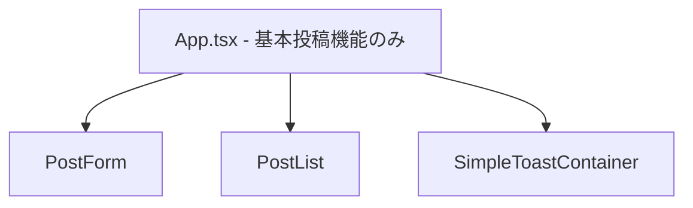
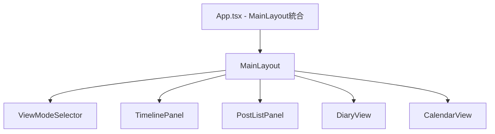
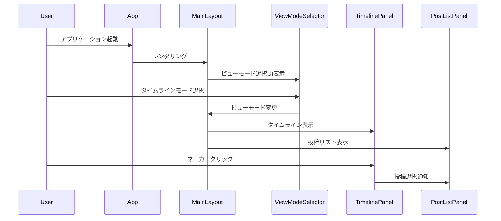

# 設計書

## 概要

既に実装済みのタイムライン機能を現在のApp.tsxに統合し、MainLayoutを使用した統合アプリケーションを構築する。最小限の変更で最大の機能を提供することを目標とする。

## アーキテクチャ

### 現在の状況

### 統合後の構成

## コンポーネント統合

### App.tsx の変更

**変更前:**
- 直接PostForm、PostList、SimpleToastContainerを使用
- useSimplePostsとuseToastを直接使用
- 基本的なレイアウトのみ

**変更後:**
- MainLayoutを使用
- AppContextを通じた状態管理
- ビューモード切り替え対応

### 必要な依存関係

#### 1. PostPreview コンポーネント
- TimelineMarkerで使用される
- 投稿のプレビュー表示機能
- 最小限の実装で対応

#### 2. performanceCache ユーティリティ
- timelineUtilsで使用される
- キャッシュ機能の基本実装
- パフォーマンス最適化用

#### 3. usePerformanceMonitor フック
- TimelinePanelで使用される
- 基本的なモニタリング機能
- 開発時のパフォーマンス確認用

## データフロー

### 統合後のデータフロー

## 実装戦略

### フェーズ1: 基本統合
1. App.tsxをMainLayoutを使用する形に変更
2. 不足している基本コンポーネントの実装
3. 基本的な動作確認

### フェーズ2: 依存関係解決
1. PostPreviewコンポーネントの実装
2. performanceCacheの基本実装
3. usePerformanceMonitorの基本実装

### フェーズ3: 動作確認とテスト
1. タイムライン機能の動作確認
2. ビューモード切り替えの確認
3. 既存機能の動作確認

## エラーハンドリング

### 想定されるエラー

1. **コンポーネント不足エラー**
   - 不足コンポーネントの基本実装で対応
   - エラーバウンダリーでの適切な処理

2. **パフォーマンス関連エラー**
   - キャッシュ機能の基本実装
   - フォールバック処理の提供

3. **状態管理エラー**
   - AppContextの適切な初期化
   - エラー状態の適切な管理

## テスト戦略

### 最小限のテスト

1. **統合テスト**
   - App.tsxの基本レンダリング確認
   - MainLayoutの統合確認

2. **機能テスト**
   - タイムライン表示の基本動作
   - ビューモード切り替えの動作

3. **既存機能テスト**
   - 投稿作成・編集・削除の動作確認
   - 既存テストの継続実行

## パフォーマンス考慮事項

### 最適化戦略

1. **遅延読み込み**
   - 必要に応じてコンポーネントの遅延読み込み
   - 初期表示の高速化

2. **キャッシュ機能**
   - 基本的なキャッシュ機能の実装
   - 計算結果の再利用

3. **メモ化**
   - React.memoの適切な使用
   - 不要な再レンダリングの防止