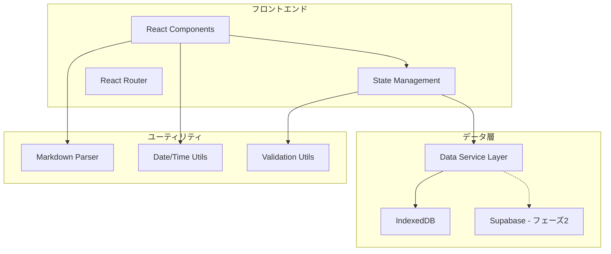

# 設計書

## 概要

タイムラインメモアプリは、気軽にメモや感情を記録できるWebアプリケーションです。フェーズ1では個人用のオフラインアプリとして、IndexedDBを使用したローカルストレージで動作し、フェーズ2でSupabaseを使用したクラウド連携に拡張可能な設計とします。

## アーキテクチャ

### 技術スタック

**フロントエンド:**
- React 18 + TypeScript
- Vite（開発環境・ビルドツール）
- Tailwind CSS（スタイリング）
- React Markdown（Markdown レンダリング）

**データストレージ:**
- IndexedDB（フェーズ1：ローカルストレージ）
- Supabase（フェーズ2：クラウドストレージ）

**デプロイメント:**
- Vercel または GitHub Pages（静的ホスティング）

### アーキテクチャ図



## コンポーネント設計

### 主要コンポーネント

#### 1. App Component
- アプリケーションのルートコンポーネント
- レイアウトの基本構造を提供
- データの初期化を担当

#### 2. Layout Components

**MainLayout**
- 左右分割レイアウトの実装
- レスポンシブデザインの制御

**TimelinePanel**
- 左側の時間軸エリア
- 時間軸ライン、マーカー、ホバープレビューの表示

**PostListPanel**
- 右側の投稿リストエリア
- 投稿の一覧表示、スクロール制御

#### 3. Post Components

**PostForm**
- 新規投稿・編集フォーム
- Markdown入力サポート
- バリデーション機能

**PostItem**
- 個別投稿の表示
- Markdownレンダリング
- 編集・削除ボタン

**PostPreview**
- 時間軸マーカーホバー時のプレビュー表示

#### 4. Timeline Components

**TimelineAxis**
- 縦の時間軸ライン
- 時間ラベルの表示

**TimelineMarker**
- 投稿時刻のマーカー（ドット）
- クリック・ホバーイベント処理

### コンポーネント階層

```
App
├── MainLayout
│   ├── Header
│   │   └── PostForm
│   └── ContentArea
│       ├── TimelinePanel
│       │   ├── TimelineAxis
│       │   └── TimelineMarker[]
│       └── PostListPanel
│           └── PostItem[]
└── Modal (編集・削除確認)
```

## データモデル

### Post Entity

```typescript
interface Post {
  id: string;           // UUID
  content: string;      // Markdown対応のコンテンツ
  createdAt: Date;      // 投稿日時
  updatedAt: Date;      // 更新日時
  tags?: string[];      // 将来拡張用のタグ機能
}
```

### Timeline Data Structure

```typescript
interface TimelineData {
  posts: Post[];
  timeRange: {
    start: Date;
    end: Date;
  };
}

interface TimelineMarkerData {
  timestamp: Date;
  postIds: string[];    // 同じ時間帯の複数投稿対応
  position: number;     // 時間軸上の位置（%）
}
```

## データ層設計

### Data Service Layer

抽象化されたデータアクセス層を実装し、フェーズ2でのクラウド連携に備えます。

```typescript
interface DataService {
  // CRUD操作
  createPost(content: string): Promise<Post>;
  updatePost(id: string, content: string): Promise<Post>;
  deletePost(id: string): Promise<void>;
  getPost(id: string): Promise<Post | null>;
  
  // 一覧・検索
  getAllPosts(): Promise<Post[]>;
  getPostsByDateRange(start: Date, end: Date): Promise<Post[]>;
  
  // リアルタイム更新（フェーズ2）
  subscribeToUpdates(callback: (posts: Post[]) => void): () => void;
}
```

### IndexedDB Implementation

```typescript
class IndexedDBService implements DataService {
  private dbName = 'TimelineMemoApp';
  private version = 1;
  private storeName = 'posts';
  
  // IndexedDB操作の実装
}
```

### Supabase Implementation (フェーズ2)

```typescript
class SupabaseService implements DataService {
  private supabase: SupabaseClient;
  
  // Supabase操作の実装
  // リアルタイム更新の実装
}
```

## 状態管理

### React Context + useReducer

軽量な状態管理として、React Context APIとuseReducerを使用します。

```typescript
interface AppState {
  posts: Post[];
  selectedPostId: string | null;
  isLoading: boolean;
  error: string | null;
  viewMode: 'timeline' | 'list';
}

type AppAction = 
  | { type: 'LOAD_POSTS'; payload: Post[] }
  | { type: 'ADD_POST'; payload: Post }
  | { type: 'UPDATE_POST'; payload: Post }
  | { type: 'DELETE_POST'; payload: string }
  | { type: 'SELECT_POST'; payload: string | null }
  | { type: 'SET_LOADING'; payload: boolean }
  | { type: 'SET_ERROR'; payload: string | null };
```

## UI/UX設計

### レイアウト仕様

**デスクトップ（1024px以上）:**
- 左側パネル: 300px固定幅
- 右側パネル: 残りの幅
- 最小幅: 768px

**タブレット（768px - 1023px）:**
- 左側パネル: 250px固定幅
- 右側パネル: 残りの幅

**モバイル（767px以下）:**
- 上下分割レイアウトに変更
- 上部: 時間軸（高さ200px）
- 下部: 投稿リスト

### 時間軸設計

**時間軸の表示範囲:**
- デフォルト: 過去24時間
- 投稿がある場合: 最古の投稿から現在まで
- 最小表示範囲: 1時間

**マーカー配置:**
- 時間軸の高さに対する相対位置で配置
- 同じ時間帯（±5分）の投稿は近接配置
- マーカーサイズ: 8px（通常）、12px（選択時）

### インタラクション設計

**時間軸マーカー:**
- ホバー: プレビューツールチップ表示（最大100文字）
- クリック: 右側リストで該当投稿をハイライト

**投稿リスト:**
- スクロール: 対応する時間軸マーカーをハイライト
- 投稿カード: ホバーで軽微なエレベーション効果

## エラーハンドリング

### エラー分類

1. **データ操作エラー**
   - IndexedDB接続エラー
   - データ保存失敗
   - データ読み込み失敗

2. **バリデーションエラー**
   - 空のコンテンツ投稿
   - 不正なMarkdown記法

3. **UI操作エラー**
   - ネットワーク接続エラー（フェーズ2）
   - 権限エラー（フェーズ2）

### エラー表示

- トースト通知でユーザーフレンドリーなメッセージ
- 重要なエラーはモーダルダイアログで表示
- 開発環境ではコンソールに詳細ログ出力

## テスト戦略

### 単体テスト
- React Testing Library + Jest
- コンポーネントの動作テスト
- データサービス層のテスト

### 統合テスト
- IndexedDB操作のテスト
- コンポーネント間の連携テスト

### E2Eテスト
- Playwright
- 主要なユーザーフロー
- レスポンシブデザインの確認

### テスト対象

1. **投稿機能**
   - 新規投稿作成
   - 投稿編集・削除
   - Markdownレンダリング

2. **タイムライン機能**
   - 時間軸表示
   - マーカークリック・ホバー
   - リストとの連携

3. **データ永続化**
   - IndexedDB保存・読み込み
   - ブラウザ再起動後のデータ復元

## パフォーマンス考慮事項

### 最適化戦略

1. **仮想化**
   - 大量の投稿がある場合の仮想スクロール実装

2. **メモ化**
   - React.memo、useMemo、useCallbackの適切な使用
   - 時間軸計算結果のキャッシュ

3. **遅延読み込み**
   - 古い投稿の段階的読み込み
   - 画像やメディアの遅延読み込み（将来拡張）

4. **バンドルサイズ最適化**
   - Tree shaking
   - Code splitting
   - 不要なライブラリの除去

## セキュリティ考慮事項

### フェーズ1（ローカルストレージ）
- XSS対策: DOMPurifyでMarkdownサニタイズ
- CSP（Content Security Policy）の設定

### フェーズ2（クラウド連携）
- 認証・認可の実装
- HTTPS通信の強制
- データ暗号化
- Rate limiting